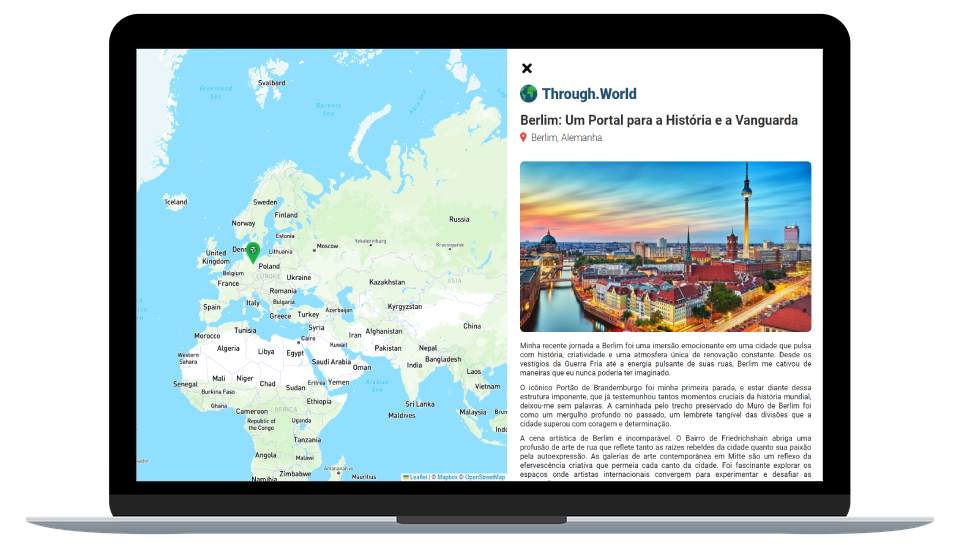

<h1 align="center">
  
</h1>

  

  <a href="#-techs">✨ Techs</a>&nbsp;&nbsp;&nbsp;|&nbsp;&nbsp;&nbsp;
  <a href="#-project">💻 Project</a>&nbsp;&nbsp;&nbsp;|&nbsp;&nbsp;&nbsp;
  <a href="#-how-to-start">🚀 How to Start</a>&nbsp;&nbsp;&nbsp;

  

